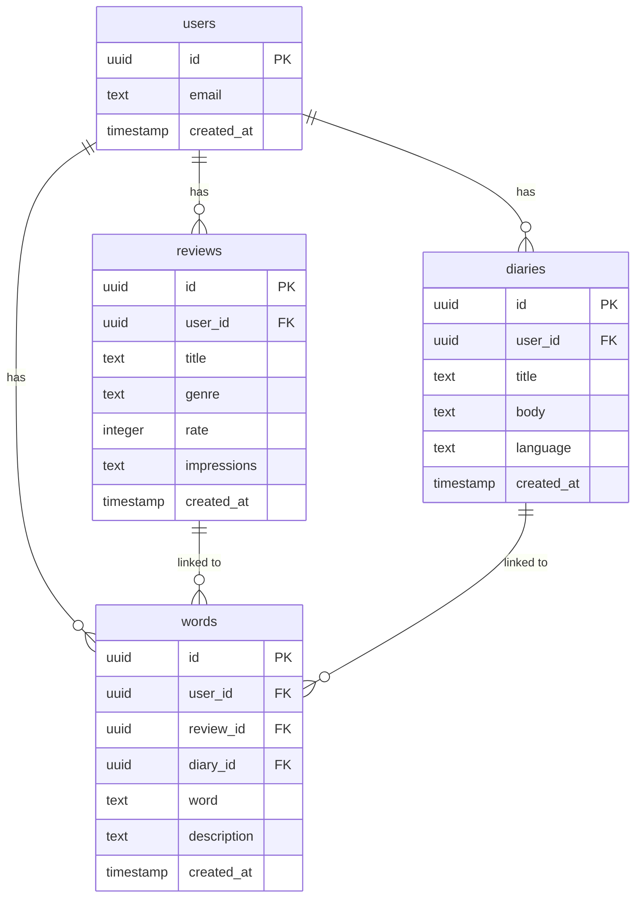

# MeMento

> 映画や小説、音楽、その日あった些細なことなど、日々の体験と想いを記録に残す。

## 目次
 
1. [概要](#概要)
2. [ターゲットユーザー](#ターゲットユーザー)
3. [用語定義](#用語定義)
4. [技術スタック](#技術スタック)
5. [機能一覧](#機能一覧)
6. [画面一覧](#画面一覧)
7. [DB設計](#db設計)
8. [非機能要件](#非機能要件)
9. [今後の拡張アイデア](#今後の拡張アイデア)

## 概要

体験は、言葉にしてはじめて自分のものになる。

映画、小説、音楽等から得た感動や気づきを言葉に変えアウトプットし、思考と感性を磨くための記録アプリ。

日記機能も備え、日常のあらゆる体験をアウトプットの習慣へとつなげる。

## ターゲットユーザー
 
- インプットをアウトプットに変える習慣をつけたい人
- 文章力・語彙力を日常の中で継続的に高めたい人
- 映画・小説・音楽の記録を一元管理したい人
 

## 用語定義

| 用語 | 定義 |
|------|------|
| **レビュー** | 映画・小説・音楽に対する感想・評価の記録 |
| **ダイアリー** | 日々の出来事や思考を記録した日記 |
| **ワード** | レビュー・ダイアリー内で記録した語彙・表現・豆知識 |
| **ジャンル** | コンテンツの種別（映画・小説・音楽） |
| **レート** | コンテンツへの5段階評価 |

## 技術スタック

| 役割 | 技術 |
|------|------|
| フロントエンド | Next.js / React |
| バックエンド | Supabase |
| データベース | PostgreSQL（Supabase） |
| 認証 | Supabase Auth |
| デプロイ | Vercel |
| スタイリング | Tailwind CSS |

## 機能一覧

### Must（必須機能）
- [ ] レビューの作成・閲覧（感想・ジャンル・レート）
- [ ] ダイアリーの作成・閲覧
- [ ] 記録一覧のわかりやすい表示
- [ ] ユーザー認証（ログイン・新規登録）
- [ ] ワードの記録

### Should（あると良い機能）
- [ ] AIによる文章添削
- [ ] AIによる英訳・和訳（英語でのアウトプット支援）

### Could（余裕があれば）
- [ ] 記録したワードのテスト形式出題
- [ ] 鑑賞・読書履歴に基づく次におすすめ作品の提案
- [ ] 過去の記録をランダムに振り返るリマインダー機能

## 画面設計
### 画面一覧

| 画面名 | URL | 説明 |
|--------|-----|------|
| ダッシュボード | `/` | 最近の記録一覧 |
| ログイン | `/login` | メール・パスワードでログイン |
| 新規登録 | `/register` | アカウント作成 |
| レビュー一覧 | `/reviews` | レビューの一覧表示 |
| レビュー詳細 | `/reviews/[id]` | レビューの詳細表示 |
| レビュー作成 | `/reviews/new` | 新規レビューの作成 |
| ダイアリー一覧 | `/diaries` | 日記の一覧表示 |
| ダイアリー詳細 | `/diaries/[id]` | 日記の詳細表示 |
| ダイアリー作成 | `/diaries/new` | 新規日記の作成 |
| ワード一覧 | `/words` | 記録した語彙・言い回しの一覧 |
| マイページ | `/mypage` | プロフィール・設定 |

### ワイヤーフレーム
Figmaで作成したワイヤーフレームは以下のリンクから確認できます。

[Figma - MeMent wireframe](https://www.figma.com/design/khMarVlOfnx1SZFJeKYPWL/review-app-wireframe?m=auto&t=p39P2Tj89US4iDiE-6)

## DB設計
 
### ER図
 

### usersテーブル
| カラム名 | 型 | 説明 |
|----------|----|------|
| id | uuid | 主キー |
| email | text | メールアドレス |
| created_at | timestamp | 作成日時 |

### reviewsテーブル
| カラム名 | 型 | 説明 |
|----------|----|------|
| id | uuid | 主キー |
| user_id | uuid | 外部キー（users.id） |
| title | text | 作品タイトル |
| genre | text | ジャンル（映画・小説・音楽） |
| rate | integer | 評価（1〜5） |
| impressions | text | 感想 |
| created_at | timestamp | 作成日時 |

### diariesテーブル
| カラム名 | 型 | 説明 |
|----------|----|------|
| id | uuid | 主キー |
| user_id | uuid | 外部キー（users.id） |
| title | text | タイトル |
| body | text | 本文 |
| language | text | 言語（ja / en） |
| created_at | timestamp | 作成日時 |

### wordsテーブル
| カラム名 | 型 | 説明 |
|----------|----|------|
| id | uuid | 主キー |
| user_id | uuid | 外部キー（users.id） |
| review_id | uuid | 外部キー（reviews.id）nullable |
| diary_id | uuid | 外部キー（diaries.id）nullable |
| word | text | 語彙・言い回し |
| description | text | 意味・説明 |
| created_at | timestamp | 作成日時 |

## 非機能要件

- レスポンシブデザイン対応（スマホ・PC）
- APIキーなどの秘密情報は`.env.local`で管理

## 今後の拡張アイデア

- 他ユーザーのレビューを公開・閲覧する機能
- フォロー・タイムライン機能
- 記録したワードのテスト・復習機能